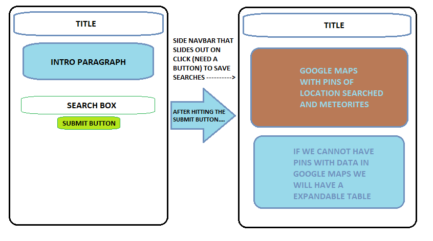

## Project One
### Project Due 02/07/19

----

**Project Title:** Meteorite Visit

**Team Members:** Natalie, David, Bob, Amy

**Project Description:** Using the NASA Metoerite landings API and the Google Maps API to track meteors that have landed on Earth.

> Using the longitude and latitude (_or GeoLocation_) of where the meteorite fell with Google Maps.
>
> Include the type_of_meteorite, mass_g, year (*year_date?*)

**API's to Use:**

[NASA | Meteorite Landings](https://data.nasa.gov/Space-Science/Meteorite-Landings/gh4g-9sfh)
>API Key: IP2uCeskAQKyGZG9LCQccVqoQbZSCqmzUli7mNl6

[Google Maps](https://developers.google.com/maps/documentation/)

## Task Assignments

### David/Bob: Google Maps
* Materialize CSS - Front End

### Natalie/Amy: Meteorite Landings
* Use Firebase to store searches - Back End
    * Store previous searches in the Firebase
    * Let the user save their searches (?)
